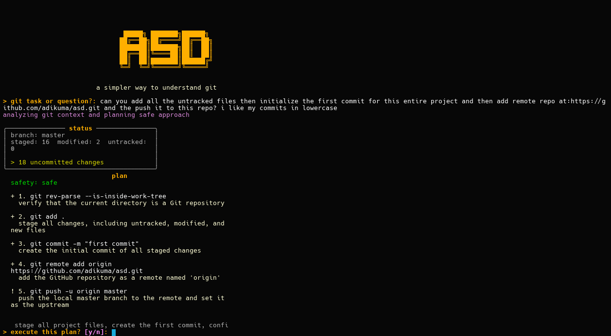

# ASD

ASD is a natural language Git assistant for the terminal. It translates plain English instructions into Git commands, helping you manage branches, histories, and merges safely and efficiently.



## Why ASD?

- I struggled with Git’s commands and conflicts.
- I wanted a simple, transparent tool—no magic—just clear steps.

## Features

- Translate English instructions into Git commands.
- Guide complex workflows with best-practice suggestions.
- Visualize commit graphs and branch histories.
- Offer safety checks and recovery guidance for risky operations.

## Getting Started

##### Installation

From PyPI:

```bash
pip install git-asd
```

Or directly from GitHub:

```bash
pip install git+https://github.com/adikuma/asd.git
```

##### Launch

```bash
asd
```

This opens ASD’s interactive terminal interface. Enter any Git task in plain English.

## Workflow

Here’s a quick look at the five-step process inside ASD:


1. **Analyze Git Context**: Examine `git status` to capture your repository’s state.
2. **Parse User Intent**: Turn your English request into a structured plan.
3. **Generate Execution Plan**:Create a safe list of Git commands.
4. **Review Plan & Status**: Inspect the plan and current status.
5. **Execute Commands**: Run each step with your approval and mini-lessons.

## Roadmap

ASD is an early project **with plenty of room for improvement**. I would love to have people test it, report issues, and suggest features so I can refine and expand its capabilities.

Contributions and feedback are welcome. Please open an issue or submit a pull request.
